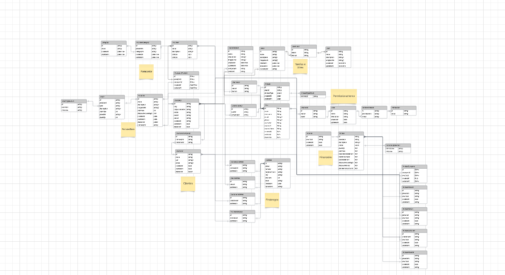

# Company Controll

## Descrição

Projeto foi desenvolvido com intenção de fazer um controle financeiro de uma empresa, com integração ao [IPN](https://www.mercadopago.com.br/developers/pt/docs/your-integrations/notifications/ipn) (Instante payment notification) do mercado-pago, quando o comercio realiza uma venda a api recebe um call-back do mercado-pago, quando isso acontence e registrado no financeiro a entrada do valor, existe algumas outras features mas essa a principal.

## Modelagem do banco de dados

Clique [aqui](https://lucid.app/lucidchart/9249def4-21d5-44d8-83bb-2ef53547f01d/edit?viewport_loc=-2018%2C-1586%2C3328%2C1656%2C0_0&invitationId=inv_4b933de3-829c-443e-baa3-15975fece2e0) caso queira ver como o banco de dados foi modelado.



## Stack do projeto

- Nest.js
- GraphQL

## Installation

```bash
$ yarn install

$ npx prisma generate

$ yarn run start:dev
```
